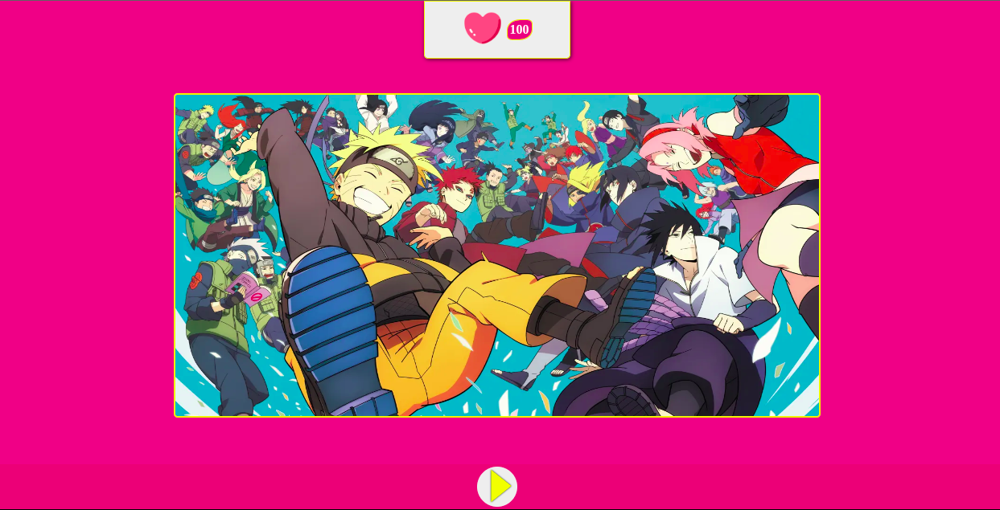

*Nesse pequeno projeto apliquei aprendizados de CSS e JS. Procurei criar algum entretenimento com um player de musica e um slide de Gifs para que a curtida seja merecida, talvez. Levei algumas semanas para concluir, visto que não entendia nem mesmo o minimo de FETCH API, originalmente havia sido feito com XMLhttpRequest, mas um amigo generoso disse que seria melhor com FETCH, e foi assim que conheci a tecnologia. Aprendi, também, um pouco de PHP e MYSQL, tecnologias usadas para buscar e armezanar informações no banco de dados*. 
##
**[Confira aqui](http://botao-de-curtir.atwebpages.com/)**
 
 

